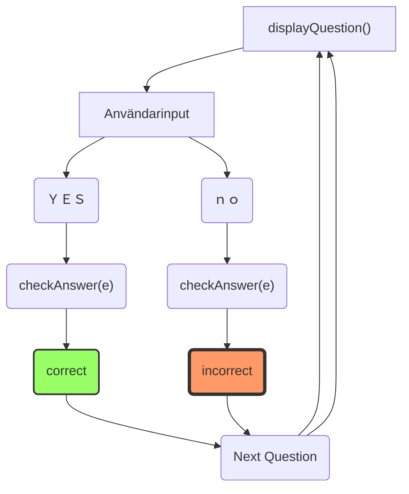

Select appearance: 
    <input type="radio" name="theme" value="chalkboard" onclick="changeTheme(this);" checked autocomplete="off"> Chalkboard</input>
    <input type="radio" name="theme" value="whiteboard" onclick="changeTheme(this);" autocomplete="off"> Whiteboard</input>


👼    

{.slide: data-background="jake-paul.jpg"}

note to self, kopiera black.css till laptop
och markdown-it-emoji.js och lägg in i index.html
disabla Fullscreen i init.ejs (i notepad)
paragraph *style me*{.red} text


:::{.green} 
hello! this is green!
:::
{data-timing: 666}

--

:::{.megaemoji}
🦘
:::

---

# ??? vad är det här?

--

## VSCode Reveal

(VSCode-extensionversion av libraryt reveal.js)

- Kan göra slides med .md (textfiler) där nya slides markeras med --- (tre bindestreck)
---

# Bakgrund till Quiz

--

Pratade på AW om djur -> göra quiz om djur!

--

# Urban Rescue Ranch

Youtubekanal av Ben Christie, Texas

</img>

---

# Demonstration av Quiz

[Click me!](http://henrikvilhelmberglund.github.io/Ankademin-Quiz)

---

Visa och förklara lite om koden

---

# 

```js
const questions = [
  {
    questionType: "trueFalse",
    question: "Are there hedgehogs at the Urban Rescue Ranch?",
    answers: "Yes,NO",
  },
  ...
  ]
```
  :::{.red}
  Yes
  :::
  :::{.green} 
  NO
  :::

--

Globala variabler 
```js {data-line-numbers="2|3"}
let debug = false;
let currentQuestion = 0;
let userAnswers = [];
let darkMode = false;
```

--

```js
function create({ elementType, appendWhere, 
innerText = "", eventListenerFunc, className = "no-class",
extraCSS = "", value = "no-value", id = "no-id", 
name = "", htmlFor = "", type = "", prependWhere }) {
  let myElement = document.createElement(elementType);
  myElement.innerText = innerText;

  if (eventListenerFunc) {
    myElement.addEventListener("click", eventListenerFunc);
  }
  myElement.className = className;
  myElement.className += " " + extraCSS;
  myElement.value = value;
  myElement.id = id;
  myElement.name = name;
  myElement.htmlFor = htmlFor;
  myElement.type = type;
  if (appendWhere) {
    appendWhere.append(myElement);
  }
  if (prependWhere) {
    prependWhere.prepend(myElement);
  }
  return myElement;
}
```
```js
create({ elementType: "h1", appendWhere: mainDiv, innerText: "Welcome to the quiz!" });
```

--

Visa andra funktioner i VSCode!
---

# Utmaningar: Buggar!

note: Oh hey, these are some notes. They'll be hidden in your presentation, but you can see them if you open the speaker notes window (hit 's' on your keyboard).

---

# Jake Paul

</img>

--

## question: 

What is the goal the owner of the Urban Rescue Ranch has for his animal friend DaBaby?

## answers: 

To live a peaceful and happy life,

To run from the edge to the other edge of the ranch in 10 seconds

TO FIGHT JAKE PAUL IN A BOXING MATCH

To win a prize in an exhibition

--

Smart funktion

```js
function capitalizeFirstLetter(string) {
  return string.charAt(0).toUpperCase() + string.slice(1);
}

console.log(capitalizeFirstLetter('foo')); // Foo
```

--

Min funktion
```js
function capitalize(string) {
  string = Array.from(string);
  string.forEach((character, i) => {
    if (i === 0) {
      string[0] = character.toUpperCase();
    }
    else {
      string[i] = character.toLowerCase();
    }
  });
  string = string.join("");
  return string;
}
console.log(capitalize("FOO FIGHTERS"); // Foo fighters
```

--

TO FIGHT JAKE PAUL IN A BOXING MATCH

:::{.element class="fragment"}
To fight jake paul in a boxing match
:::

:::{.element class="fragment"}
To fight Jake Paul in a boxing match
:::

--

```js {data-line-numbers="3|5-7|8-10"}
function capitalize(string) {
  string = Array.from(string);
  let capsNextCharacter = false;
  string.forEach((character, i) => {
    if (character === "*") {
      capsNextCharacter = true;
    }
    else if (capsNextCharacter) {
      string[i] = character.toUpperCase();
      capsNextCharacter = false;
    }
    else if (i === 0) {
      string[0] = character.toUpperCase();
    }
    else {
      string[i] = character.toLowerCase();
    }
  });
  string = string.join("");
  string = string.replaceAll("*", "");
  return string;
}
```

:::{.element class="fragment"}
```js
capitalize("TO FIGHT *JAKE *PAUL IN A BOXING MATCH")
```
:::
:::{.element class="fragment" .green}
```
// To fight Jake Paul in a boxing match 
```
:fa-check:
:::


--


{.r-stretch}

---

# CSS

protip: inte "" i .css

# 

---

# Lärdomar

--

# VSCode är bra

- Bracket Pairs {."fragment"}
- ErrorLens-extension {."fragment"}
- quick-lint-js {."fragment"}

--

# Ha allt i specialiserade funktioner

- create()
- toggleDarkMode()
- capitalize()
- startQuizPage()
- displayQuestion()
- returnCorrectAnswers()
- checkAnswer()
- nextQuestion()
- showResults()
- resetQuiz() 

--

# NPM + Bundler (?)

- Behövdes för att ha installerad version av Master CSS {."fragment"}
- Vite {."fragment"}

--

# npm install library-name

installerar library-name
- npm install @master/css
- npm create vite@latest

men finns också yarn och pnpm (???)

--

från package.json

```
...
"scripts": {
    "dev": "vite",
    "build": "vite build",
    "preview": "vite preview",
    "deploy": "gh-pages -d dist"
  },
...
```
